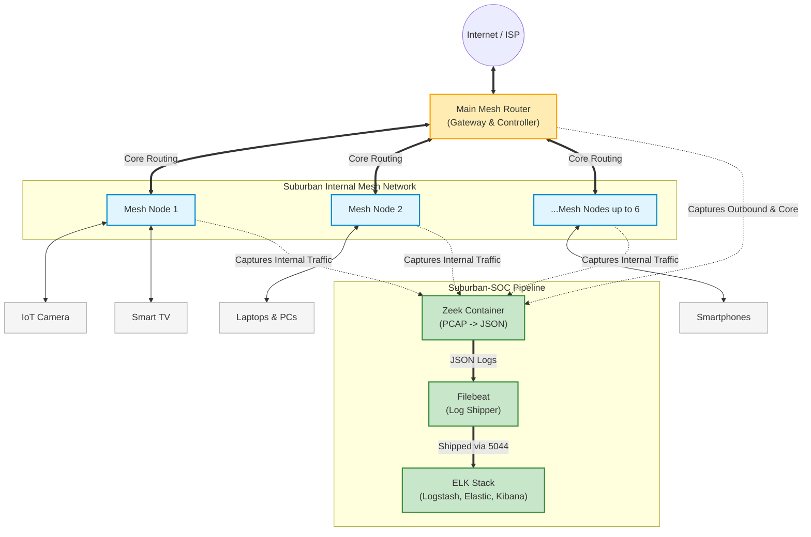

# Suburban-SOC Network Topology & Traffic Monitoring Scope

Based on the project requirements, the monitoring scope for the **Suburban-SOC pipeline** specifically includes the **internal traffic from the mesh nodes**. This allows the SOC to detect lateral movement, internal device communications, and suspicious behavior happening *behind* the gateway.

Here is a visual representation of how that layout works, identifying exactly where traffic is being captured relative to the rest of the network elements.

> [!TIP]
> By capturing traffic at the local mesh nodes (or centrally at the gateway tracking internal node interfaces), the SOC gains heavy visibility into direct device-to-device communications that wouldn't be seen if we only monitored boundary HTTP outbound traffic to the ISP.

### Resolution for Issue #8 (Baseline Traffic Monitoring Scope)

1. **Traffic Included:** All internal traffic passing bounds between connected clients (laptops, IoT cameras) and their respective mesh AP nodes, as well as traffic between nodes and the primary gateway.
2. **Advantages:** Highly advantageous for identifying compromised smart devices (IoT) launching internal attacks against other devices on your home network.
3. **Implications for Zeek:** Zeek will process a high percentage of raw PCAPs. To avoid dropping packets, performance and log rotation will become important factors later on, but the enhanced visibility is a necessary trade-off for a true SOC setup.
