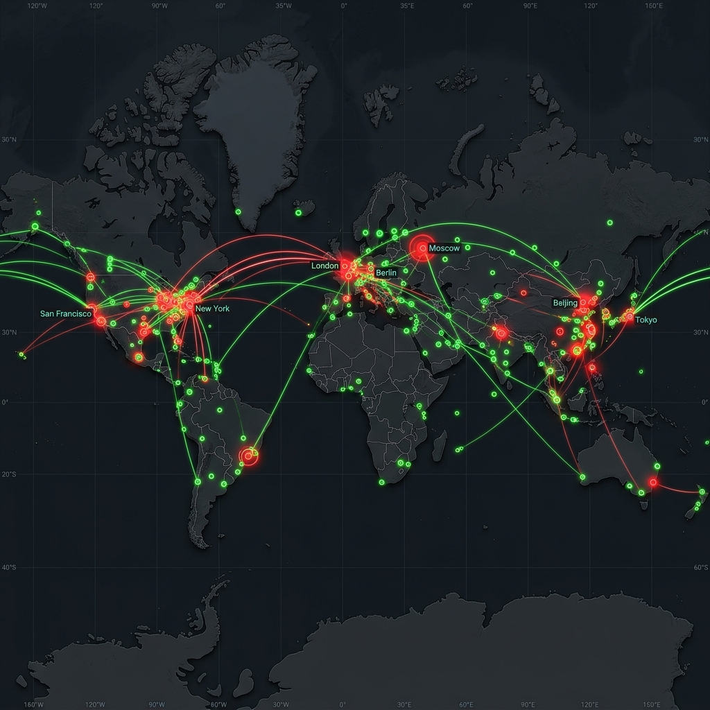
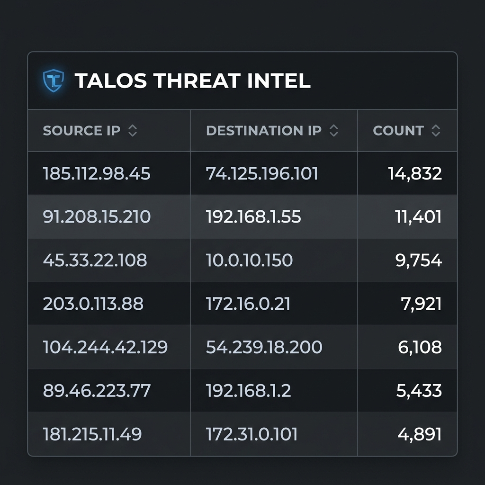

# Evidence Directory

> **Important:** DO NOT upload raw evidence files (like raw PCAPs) directly to this repository. Only store hashes and download links here.
>
> Screenshots are stored in two locations:
> - **Repository:** `evidence/screenshots/` (GitHub-hosted, linked below)
> - **Wiki:** [cis3353_s26_TL_SG_MF Wiki](https://github.com/sterlinggarnett/cis3353_s26_TL_SG_MF/wiki) (drag-and-drop uploads)

---

## Evidence Log

| # | Description | Type | SHA-256 Hash | Links |
|---|---|---|---|---|
| 1 | Kibana GeoIP Map — live network traffic origins plotted by geographic location, confirming Logstash GeoIP enrichment is working end-to-end | Screenshot | `3a8527bd2bd17150b7cbff04bdf95d53ea268f3ba43704580eab9ff3c9ba68db` | [Repo](screenshots/kibana-geoip-map.png) · [Wiki](https://github.com/sterlinggarnett/cis3353_s26_TL_SG_MF/wiki/kibana-geoip-map) |
| 2 | Kibana Pie Chart — protocol and traffic distribution breakdown, confirming Zeek JSON logs are indexed and queryable in Elasticsearch | Screenshot | `168ba0532de146713b0fee27dbfb537b5c9aa2f29a8b7183472a2406306679a8` | [Repo](screenshots/kibana-pie-chart.png) · [Wiki](https://github.com/sterlinggarnett/cis3353_s26_TL_SG_MF/wiki/kibana-pie-chart) |
| 3 | Kibana Threat Intelligence Panel — security notice visualization confirming Zeek notice logs are flowing through the full pipeline into Kibana dashboards | Screenshot | `d5971c97d3c75253613d1da44887a0e55eb11350f477e6bce3edddc8d36ee70f` | [Repo](screenshots/kibana-intel-panel.png) · [Wiki](https://github.com/sterlinggarnett/cis3353_s26_TL_SG_MF/wiki/kibana-intel-panel) |
| 4 | Logstash Pipeline Configuration — documents the Filebeat→Logstash→Elasticsearch connection with GeoIP enrichment, ECS field mapping, and daily index routing | Config File | `04793dccd031899c00d76e768ba7eb59ce997f9255a3e26a76d133d58a81d08a` | [Repo](../configs/logstash.conf) |
| 5 | Architecture Diagram — full pipeline diagram (OpenWrt → Zeek → Logstash → Elasticsearch → Kibana) with runtime environments and port numbers labeled | Diagram | `e2a59fc5c07432719a484aa7773bda166b46b90634925235fac07bce8064b40f` | [Repo](../docs/architecture-diagram.png) · [Wiki](https://github.com/sterlinggarnett/cis3353_s26_TL_SG_MF/wiki/Architecture) |

---

## Screenshots

### 1. GeoIP Map — Live Traffic Origins


### 2. Traffic Distribution Pie Chart


### 3. Threat Intelligence Panel


---

## Verification Notes

- **Pipeline tested:** 2026-04-29
- **Data source:** OpenWrt router (`10.18.81.1`) via SSH/tcpdump → Zeek Docker container
- **Log volume:** Real home network traffic captured on `br-lan` and `bat0` interfaces
- **Dashboard:** `configs/server/suburban_soc_dashboards_bundle_final.ndjson` (importable into Kibana)
- **Index pattern:** `logstash-*` (verified in Kibana Discover)

---

## How to Verify SHA-256 Hashes

**Windows (PowerShell):**
```powershell
Get-FileHash evidence\screenshots\kibana-geoip-map.png -Algorithm SHA256
```

**Linux/WSL:**
```bash
sha256sum evidence/screenshots/kibana-geoip-map.png
```
